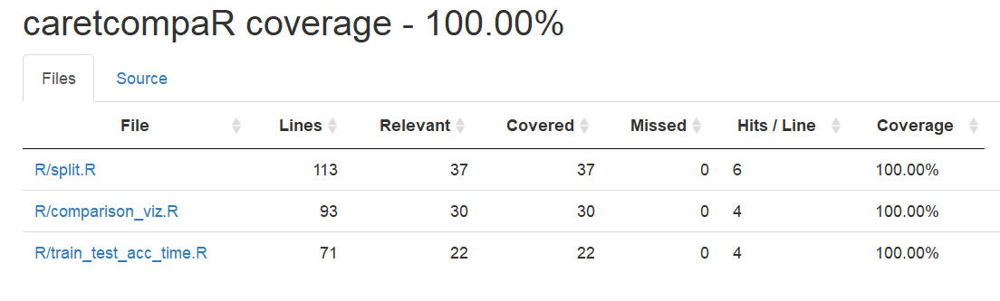

# caretcompaR
[](https://travis-ci.org/jessimk/caretcompaR) [](https://codecov.io/gh/jessimk/caretcompaR)

| Contributor                  | Github              | CWL |
| --------------------- |-----------------------|-----------------------|
| Birinder Singh | [birinder1469](https://github.com/Birinder1469) | bsingh02 |
| Jes Simkin | [jessimk](https://github.com/jessimk) | jess354 |
| Talha Siddiqui | [talhaadnan100](https://github.com/talhaadnan100) | talhaas |

### Summary

An `R` package facilitating beautifully efficient comparisons of machine learning classifiers and models.

__caretcompaR__ harnesses the power of <a href="https://topepo.github.io/caret/index.html">caret</a>, combining it with `R` dataframes for easy, breezy, and beautiful machine learning regressors and classifiers exploration.   

### Installation

1. Install devtools from CRAN `install.packages("devtools", build_vignettes = TRUE)`
2. In an R environment, load devtools `library(devtools)`
3. Install caretcompaR from github `install_github("UBC-MDS/caretcompaR", build_vignettes = TRUE)`
4. Load caretcompaR `library(caretcompaR)

### The ML models available for testing  

| Model Name / Software Packages                 | Method Value             | Version | Libraries|
| --------------------- |-----------------------| ----|---|
| SVM Polynomial  | svmPoly |0.9.27  | kernlab|
| SVM Linear | svmLinear |0.9.27  | kernlab|
| Knn | knn |0.9.3  | |
| Random Forest | rf | 4.6.14 |randomForest |
| Naive Bayes | naive_bayes  | 0.9.3 | naivebayes|
| caret | caret |  6.0.81| caret |
| R version | R version |  3.5.2 | |


While running the package the dictionary should contain the Method value in the list of models.
```
For example :
models <- c('svmPoly','knn','rf','svmLinear','naive_bayes')
```
For further details please refer to the caret package url : [caret_package](http://topepo.github.io/caret/available-models.html)  


### Usage

```

#Loading in the data and splitting it into an X dataframe of features and a y 'Target' vector.
X <- iris[,1:4]
y <- iris$Species

head(X)
head(y)

#Splitting data into a training set, a validation set, a combined training and validation set, as well as a test set.
# The split will be 40% training, 30% validation, and 30% test.

glorious_datasets <- caretcompaR::split(X, y, 0.4, 0.3, 0.3)

#' Resulting dataframes are sorted in a list in this order:
#' 1. X_train ,
#' 2. y_train ,
#' 3. X_validation ,
#' 4. y_validation ,
#' 5. X_train_validation ,
#' 6. y_train_validation ,
#' 7. X_test ,
#' 8. y_test .

#Assigning our freshly split datasets so we can run some machine learning models
X_train <- glorious_datasets[[1]]
y_train <- glorious_datasets[[2]]

X_test <- glorious_datasets[[7]]
y_test <- glorious_datasets[[8]]

#Let's try these classifiers
models <- c('svmPoly','knn','rf')

#Running our chosen models on our data and building a beautiful summary
results_df <- caretcompaR::train_test_acc_time(models,X_train,y_train$target,X_test,y_test$target)

#Let's see how we did in terms of train accuracy, test accuracy, and timing
results_df

#Now let's also take a look at some plots to compare our models

# Plot the accuracy of the models
caretcompaR::comparison_viz(results_df,'accuracy')

# Plot the timing of the models
caretcompaR::comparison_viz(results_df,'time')

```

### Summary

#### Function 1 :

- `split()`

	The function splits the training input samples `X`, and target values `y` (class labels in classification, real numbers in regression) into train, test and validation sets according to specified proportions.

	Outputs four `X` dataframes and four `y` lists. One each for training, validation, test, and combined training and validation.

	__Inputs:__
	- X set, type: `data.frame()`
	- Y set, type: `data.frame()` or `list()`
	- proportion of train data, type: `float`
	- proportion of validation data, type: `float`
	- proportion of test data, type: `float`

	__Outputs:__  

	- X train set, type: `data.frame()`
	- y train, type: `list()`
	- X validation set, type: `data.frame()`
	- y validation, type: `list()`
	- X train and validation set, type: `data.frame()`
	- y train and validation, type: `list()`
	- X test set, type: `data.frame()`
  - y test, type: `list()`

#### Function 2 :

- `train_test_acc_time()`

	The purpose of this function is to compare different caret regressors or classifiers in terms of training and test accuracies, and the time it takes to fit and predict. The function inputs are list of models, input train samples `Xtrain`(input features), input test samples `Xtest`, target train values `ytrain` and target test values `ytest` (continuous or categorical).

  The function outputs a beautiful dataframe with training & test scores, model variance, and the time it takes to fit and predict using different models.

	__Inputs:__   
	- List of caret regressors or classifiers,  type: `list('method')`
	- X train set, type: `data.frame()`
	- Y train set, type:  `data.frame()` or `list()`
	- X test set, type: `data.frame()`
	- Y test set, type:  `data.frame()` or `list()`

	__Outputs:__

	- Dataframe with 7 columns: (1) regressor or classifier name, (2) training accuracy, (3) test accuracy, (4) model variance, (5) time it takes to fit, (6) time it takes to predict and (7) total time. The dataframe will be sorted by test score in descending order. Type: `data.frame()`

#### Function 3 :

- `comparison_viz()`  

  The purpose of this function is to visualize the output of `train_test_acc_time()` for easy communication and interpretation. The user has the choice to visualize a comparison of accuracies or time. It takes in a dataframe with 7 attributes i.e. model name, training & test scores, model variance, and the time it takes to fit, predict and total time. <br>
  Outputs a beautiful <a href="https://ggplot2.tidyverse.org/">ggplot</a> bar chart comparison of different models' training and test scores or the time it takes to fit and predict. <br>

	__Inputs:__   
	- Dataframe with 7 columns: (1) regressor or classifier name, (2) training accuracy, (3) test accuracy, (4) model variance, (5) time it takes to fit, (6) time it takes to predict and (7) total time. Type: `data.frame()`
  - Choice of `accuracy` or `time`. Default value is `accuracy`. Type: `string`

	__Outputs:__

	- Bar chart of accuracies or time comparison by models saved to root directory. Type: `png`

### Where does this package fit in?

This package provides functions to help make the early stages of model selection and exploration easier to cycle through and meaningfully compare.

Our idea for this package was to facilitate the comparison of machine learning classifiers and models. Our inspiration came from <a href="https://ubc-mds.github.io/descriptions/">UBC MDS DSCI 573</a> lab assignments where we learned to combine python's `sci-kit learn` with `pandas` in order to produce interpretable comparisons of train and test accuracies and time efficiencies across models.

We are not currently aware of any packages that combine `caret` and dataframes for efficient and interpretable model-to-model comparisons. We expect that this combination is used in practice and after having used it while learning machine learning techniques during our UBC MDS courework, we thought it would be a good combination of tools to formally package together.

### Testing

`covr` package coverage results:

```
caretcompaR Coverage: 100.00%
R/comparison_viz.R: 100.00%
R/split.R: 100.00%
R/train_test_acc_time.R: 100.00%
```



Build Check results:

```
==> devtools::check()

Updating caretcompaR documentation
Writing NAMESPACE
Loading caretcompaR
Writing NAMESPACE
-- Building ----------------------------------------------------------------------- caretcompaR --
Setting env vars:
* CFLAGS    : -Wall -pedantic -fdiagnostics-color=always
* CXXFLAGS  : -Wall -pedantic -fdiagnostics-color=always
* CXX11FLAGS: -Wall -pedantic -fdiagnostics-color=always
--------------------------------------------------------------------------------------------------
v  checking for file 'C:\Users\talha\OneDrive\Documents\MDS\block5\524\caretcompaR/DESCRIPTION' ...
-  preparing 'caretcompaR': (418ms)
v  checking DESCRIPTION meta-information ...
-  installing the package to build vignettes
v  creating vignettes (16.6s)
-  checking for LF line-endings in source and make files and shell scripts (541ms)
-  checking for empty or unneeded directories
-  building 'caretcompaR_0.0.0.9000.tar.gz'

-- Checking ----------------------------------------------------------------------- caretcompaR --
Setting env vars:
* _R_CHECK_CRAN_INCOMING_USE_ASPELL_: TRUE
* _R_CHECK_CRAN_INCOMING_REMOTE_    : FALSE
* _R_CHECK_CRAN_INCOMING_           : FALSE
* _R_CHECK_FORCE_SUGGESTS_          : FALSE
-- R CMD check -----------------------------------------------------------------

   Welcome Talha at Sun Mar 03 13:55:03 2019 !
-  using log directory 'C:/Users/talha/OneDrive/Documents/MDS/block5/524/caretcompaR.Rcheck'
-  using R version 3.5.2 (2018-12-20)
-  using platform: x86_64-w64-mingw32 (64-bit)
-  using session charset: ISO8859-1
-  using options '--no-manual --as-cran'
v  checking for file 'caretcompaR/DESCRIPTION' ...
-  this is package 'caretcompaR' version '0.0.0.9000'
-  package encoding: UTF-8
v  checking package namespace information
v  checking package dependencies (34.1s)
v  checking if this is a source package ...
v  checking if there is a namespace
v  checking for executable files (417ms)
v  checking for hidden files and directories ...
v  checking for portable file names ...
v  checking serialization versions ...
v  checking whether package 'caretcompaR' can be installed (9.2s)
v  checking installed package size ...
v  checking package directory (465ms)
v  checking 'build' directory
v  checking DESCRIPTION meta-information ...
v  checking top-level files ...
v  checking for left-over files ...
v  checking index information ...
v  checking package subdirectories ...
v  checking R files for non-ASCII characters ...
v  checking R files for syntax errors ...
v  checking whether the package can be loaded (2.1s)
v  checking whether the package can be loaded with stated dependencies (2s)
v  checking whether the package can be unloaded cleanly (1.9s)
v  checking whether the namespace can be loaded with stated dependencies (1.8s)
v  checking whether the namespace can be unloaded cleanly (1.9s)
v  checking loading without being on the library search path (2.4s)
v  checking dependencies in R code (2s)
v  checking S3 generic/method consistency (2.5s)
v  checking replacement functions (1.9s)
v  checking foreign function calls (1.8s)
v  checking R code for possible problems (8s)
v  checking Rd files ...
v  checking Rd metadata ...
v  checking Rd line widths ...
v  checking Rd cross-references ...
v  checking for missing documentation entries (1.9s)
v  checking for code/documentation mismatches (5.5s)
v  checking Rd \usage sections (2.6s)
v  checking Rd contents ...
v  checking for unstated dependencies in examples ...
v  checking installed files from 'inst/doc' ...
v  checking files in 'vignettes' ...
v  checking examples (13.2s)
   Examples with CPU or elapsed time > 5s
                       user system elapsed
   train_test_acc_time 9.55   0.15    9.77
v  checking for unstated dependencies in 'tests' ...
-  checking tests ...
v  Running 'testthat.R' [18s]
v  checking for unstated dependencies in vignettes ...
v  checking package vignettes in 'inst/doc' ...
v  checking re-building of vignette outputs (12.4s)


-- R CMD check results ----------------------------- caretcompaR 0.0.0.9000 ----
Duration: 2m 11s

0 errors v | 0 warnings v | 0 notes v

R CMD check succeeded
```
